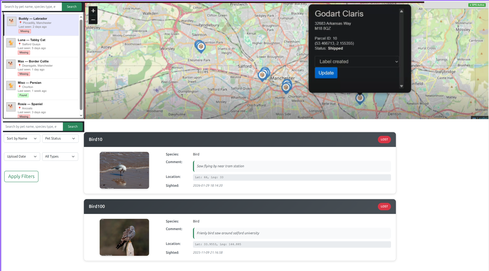

Live Link: http://sickly-impostors.poseidon.salford.ac.uk/clientserver/viewSightings.php

11Feature One: Live petMap 

1. Interactive live mapping
2. It needs to allow users to list/view missing pets with their
   stored sighting location as a list and on a petMap with a marker and marker pop-up info
   box using mapping code techniques covered in the lectures and workshops.
   The petMap should initially centre on the users own location using geolocation techniques covered in
   the workshops.

3. For authenticated users each missing pet record should be displayed with a user
   interface that allows for adding a sighting – similar to a review on Amazon or
   TripAdvisor. e.g. “spotted near the piccadilly tram stop”, “seen at the roadside next to
   McDonalds”. The sighting comment should be stored in the databased created for
   DRAFT version Assignment 1. Higher marks will be gained if well coded and structured AJAX techniques
   are used for this.

4. You will need to make use of coordinate data that you store in your database for each
   pet sighting. Location data (lat/lng) can be generated using a tool such as ChatGPT as
   demonstrated in lectures and realistic locations and data volumes will earn more marks

5. The final client application functionality sophistication and user experience is up to you to
   work on as long as it meets these main requirements above. E.g. Using JavaScript you
   can make the user experience particularly smooth and efficient for locating pets by
   moving the petMap to location when a record is selected from the list of sightings. You do
   not need to add features outside of the scope above but you are encouraged to deliver
   well structured OO code.

Requirements for Map
1. OO & Design: Cohesive JS/PHP OO architecture with clear patterns and re-use. x
2. AJAX: 3+ high-quality, efficient endpoints with robust error handling and caching where appropriate. x
3. Security: Strong input validation, CSRF/URL tokens, output encoding; shows threat-modelling decisions. x
4. Data: JSON/XML via extended DB classes; clear schemas. x
5. Map/UX: Highly sophisticated, real-time updates, smooth interactions (e.g., list to petMap focus, clustering), reliable geolocation, fully responsive; scales to 100s of items.
6. Comments: Consistent, meaningful, maintainable.
7. Strictly no prohibited tools; exemplary database usage and performance tuning.
8. Hosted on poseidon.salford.ac.uk using a MariaDB database 

Feature Live Search
1. AJAX implementation of live search feature and results for users (based on material
   in Workshops 15 & 16) including feature information where appropriate and search
   filters. Consider browser memory usage. The search feature must be powerful and
   allow effective narrowing of results to a small number from a large dataset.

Requirements for Live Search
1. OO & Design: Elegant, reusable classes; clear pattern. x
2. AJAX: Multiple endpoints (3+ if appropriate) enabling sophisticated interactions (e.g., debounced live search with ranking). x
4. Security: Comprehensive validation and tokenisation; robust input sanitisation. x
5. Data: JSON/XML contracts; paginated/filtered payloads. x
6. Performance: Excellent memory and network efficiency for 100s+ items. x
7. Comments: Consistently excellent. No prohibited tools. 
8. Hosted on poseidon.salford.ac.uk using a MariaDB database

Tech requirments 
1. DOM 
2. Eventhandler and listener 
3. SearchValidation 
4. Class & OOP
5. Ajax
6. Json
7. Design pattern
8. Geolocation API
9. Caching 
10. Leaflet 
11. Debouncing 

poseidon ssh connection: 
terminal command: ssh -L 3306:localhost:3306 username@poseidon.salford.ac.uk
and in database: conect with mariadb pass 

db_password="pass"
run the server:  php -S localhost:8000  

File that chaged: 
1. ViewSighints.phtml
2. SightingsMapDataSet.php 
3. createsighting controller 
source ~/.bashrc

Bug:
1. Address not loading in the database