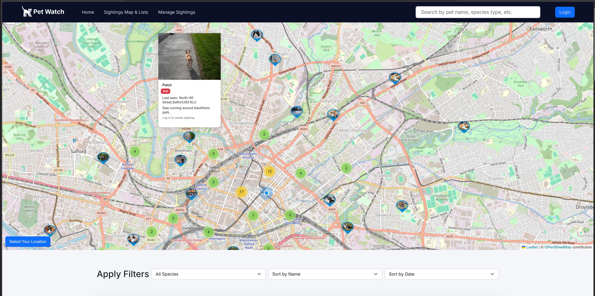

# PetWatch — Community Lost-Pet Tracker (PHP · MariaDB · Leaflet)

A community-driven web application that helps pet owners find their lost pets through crowd-sourced sighting reports on an interactive map. 
Built with plain PHP (MVC architecture), MariaDB, and JavaScript ES6 modules.

---
## Visit [`PetWatch`](https://sickly-impostors.poseidon.salford.ac.uk/clientserver/viewSightings.php) to use the site.

## What It Does

Pet owners report their lost pets with photos and details. Community members browse the map, 
and when they spot a lost pet they submit a sighting with the location. Every sighting is plotted
on an interactive map so owners can track where their pet has been seen.

---

## Features

- 🐾 **Pet management**: Owners create, update and delete lost-pet records comprising a photograph, species, breed, colour, description and status.
- 📍 **Sighting reports**: An authenticated user submits a sighting by selecting a point on the map or using device geolocation, together with a comment and the resolved street address.
- 🗺️ **Interactive map**: Leaflet with MarkerCluster renders all recorded sightings. Selecting a marker displays the associated pet record or initiates a new sighting at that coordinate.
- 🛰️ **Geolocation**: Browser geolocation tracking with a position indicator, allowing a user to identify their current location.
- 🔎 **Live search**: Debounced autocomplete over pet name, species, breed, colour, sighting comment and address, returning ranked results.
- ♾️ **Incremental loading**: Search and sighting results are paginated and retrieved on demand rather than in a single request.
- 🎚️ **Filtering and sorting**: Results may be filtered by species (dog, cat, bird) and ordered by name (A-Z, Z-A) or date (newest, oldest).
- 🔐 **Authentication and roles**: Session-based authentication with rate limiting (three attempts followed by a two-minute cooldown), restrictive session cookie attributes, and navigation determined by the `Owner` and standard user roles.
- 🛡️ **AJAX token validation**: Each asynchronous endpoint verifies a per-session token before returning data.
- 🌍 **Cached reverse geocoding**: Nominatim responses are cached on disk, with the cache bounded at 1000 entries, to remain within the service's rate limits.
- 📱 **Responsive interface**: Bootstrap 5 layout adapting to mobile, tablet and desktop viewports.
- 🧩 **No build pipeline**: The application runs directly under PHP; no package manager, bundler or compilation step is required.

---

## Tech Stack

| Layer | Technology |
| --- | --- |
| Backend | PHP 7.4+ (tested on PHP 8.2), PDO with prepared statements |
| Database | MariaDB 10.4+ / MySQL 8 |
| Frontend | Vanilla JavaScript (ES6 modules), Bootstrap 5.2, custom CSS |
| Maps | Leaflet 1.9.4, Leaflet MarkerCluster 1.5.3, OpenStreetMap tiles |
| Geocoding | Nominatim reverse-geocoding API (disk-cached) |
| Templating | Plain `.phtml` views with a shared header/footer |

---

## How It Works

**Reporting a sighting**

1. The user picks a lost pet and clicks the map (or presses the GPS button).
2. `Geolocation.js` / the map click handler produces a lat-lng pair.
3. `ReverseLatLngToHumanReadableAddress.php` turns it into a street address — served from `js/cache/geocode/` when those coordinates were seen before, otherwise fetched from Nominatim and cached.
4. `CreateSightings.php` inserts the sighting, then `LocationDataSets.php` inserts the matching location row linked by `sighting_id`.

**Rendering the map**

1. `SightingsJsonData.php` joins `pets → sightings → locations` and returns JSON.
2. `SightingsMapAndListAjax.js` fetches it with the session AJAX token attached.
3. `MapMediatorApp.js` hands the rows to `PetMap.js` (markers, clustering) and `SightingList.js` (the list beside the map) and keeps filters and sorting in sync across both.

**Live search**

1. `LiveSearchUI.js` debounces keystrokes and calls `SearchSuggestions.php` for ranked suggestions.
2. Choosing a suggestion calls `FetchPetById.php`; typing a full query calls `SearchPets.php`, which paginates with `LIMIT`/`OFFSET` for infinite scroll.

---
